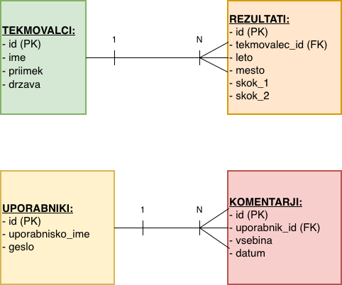

# seminarska_naloga_PB1

Seminarska naloga pri predmetu Podatkovne baze 1: **Moški smučarski skoki v Planici**

Spletna aplikacija omogoča pregled podatkov o rezultatih, državah in tekmovalcih smučarskih skokov v Planici za zadnjih 10 let (2015–2025).

## Kazalo

- [Struktura projekta](#struktura-projekta)
- [Podatkovna baza](#podatkovna-baza)
- [Funkcionalnosti](#funkcionalnosti)
- [Uporabljeni paketi](#uporabljene-tehnologije)
- [Namestitev in zagon](#namestitev-in-zagon)
- [Prijava in registracija](#prijava-in-registracija)

## Struktura projekta

```
seminarska_naloga_PB1/
├── tekstovni_vmesnik.py          # osnova za program
├── csv/                                      # izvorni podatki v csv obliki
├── static/                                   # slike in izgled spletne strani
├── templates/                            # html datoteke za posamezne strani
├── ustvari_bazo.py                   # ustvari bazo planica.db iz csv podatkov
├── dodaj_testne_podatke.py    # doda testne uporabnike in komentarje
├── model.py                              # vse SQL poizvedbe (dostop do baze)
└── aplikacija.py                         # glavni program (kliče poizvedbe iz model.py, zagon strežnika)
```

Vse SQL poizvedbe so zbrane v datoteki `model.py`. Datoteka `aplikacija.py` jih le kliče in uporablja za prikaz podatkov na spletni strani — ne vsebuje neposrednih SQL poizvedb.

## Podatkovna baza

Baza `planica.db` vsebuje 4 tabele:

- **rezultati**
- **tekmovalci**
- **uporabniki**
- **komentarji**

Tabeli `rezultati` in `tekmovalci` sta povezani preko `id`, prav tako tabeli `uporabniki` in `komentarji`.

### ER diagram



## Funkcionalnosti

Spletna stran omogoča:

- pregled rezultatov po posamezni sezoni in tekmovalcu
- pregled letvic za izbrano leto
- profil izbranega tekmovalca
- pregled statistike posameznega tekmovalca
- pregled vseh tekmovalcev za izbrano državo
- pregled vseh zmagovalcev med 2015 in 2025
- uporabo foruma (dostopno po prijavi) — objavljanje komentarjev

## Uporabljeni paketi

- flask
- sqlite3
- pandas
- glob
- os

## Namestitev in zagon

1. Ustvari bazo podatkov:
   ```bash
   python ustvari_bazo.py
   ```
2. Dodaj testne podatke (testni uporabniki in komentarji):
   ```bash
   python dodaj_testne_podatke.py
   ```
3. Zaženi aplikacijo:
   ```bash
   python aplikacija.py
   ```
4. V terminalu se izpiše naslov spletne strani (`http://127.0.0.1:5000`), ki ga prekopiraš v brskalnik.

## Prijava in registracija

Za dostop do foruma se je potrebno prijaviti.

- **Testni uporabnik:** uporabniško ime: `zala`, geslo: `1234`
- Nov uporabnik se lahko registrira s svojim uporabniškim imenom in geslom. Po registraciji se je treba še prijaviti, da pridobi dostop do foruma.
